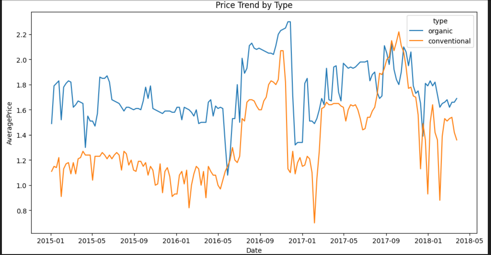

## Python & Pandas: Avocado Sales Analysis

This project demonstrates Python and Pandas skills, including:
- working with DataFrames
- creating calculated columns
- validating data consistency
- filtering data by conditions
- aggregation and exploratory analysis

### Key Tasks
- Compared `Total Volume` with calculated check sums
- Identified rows that failed validation
- Analyzed avocado price trends by region and type
- Visualized price dynamics for a specific region (Chicago)

  
### Example Visualization

### Tools & Libraries
- Python
- Pandas
- NumPy
- Seaborn

### Visualizations
The notebook includes line plots showing:
- price trends over time
- comparison between organic and conventional avocado prices
